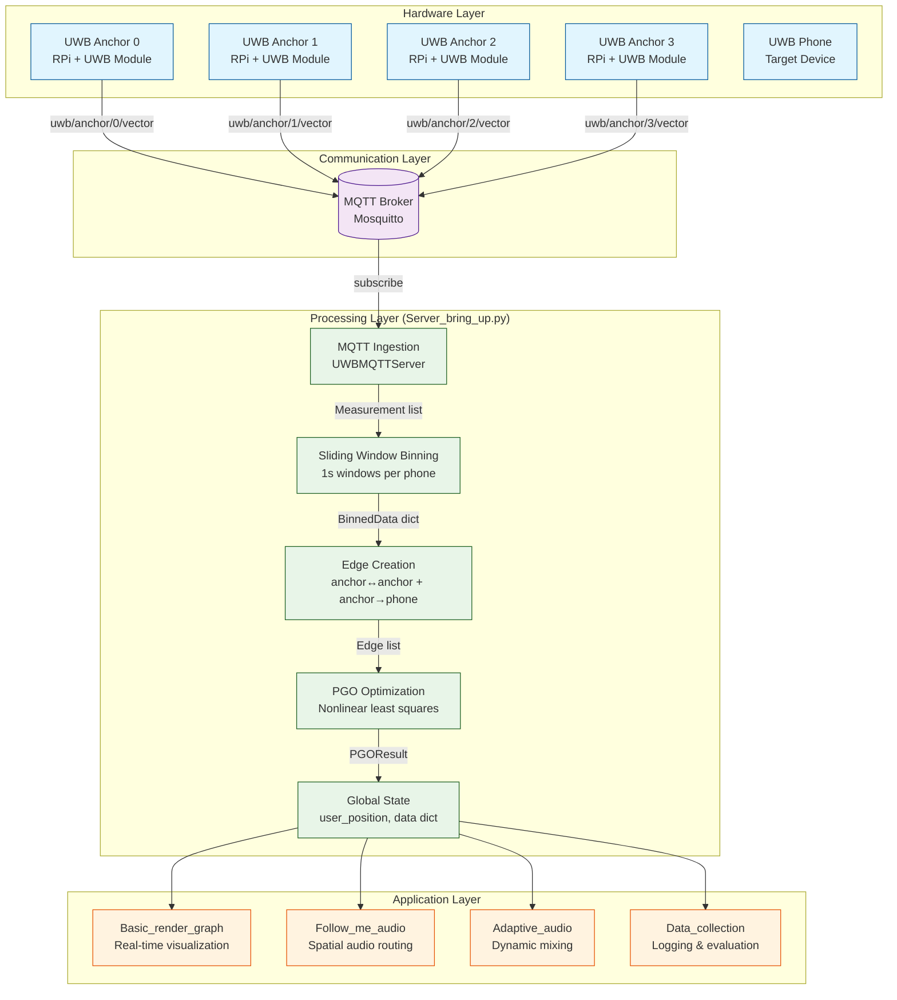

# 🚀 Project Hub — Overview & High‑Level Architecture

This repository contains **reusable packages** (e.g., `PGO`, `localization‑algos`, MQTT clients/servers, audio control) plus **bring‑up scripts** and **demos** that run across **RPi clients** and a **Laptop server**.

- **Packages**: import‑safe libraries with no side effects on import (pure modules).
- **Bring‑ups**: scripts that instantiate device roles (RPi client / Laptop server) and wire MQTT + state.
- **Demos**: thin scripts that call into running components to visualize or sonify results.
- **Data_collection**: follows the same pattern as a demo for capturing data for evaluation.

---

## 🏗️ System Architecture & Data Flow

### Overview
This UWB localization system processes real-time measurements from 4 fixed anchors to estimate the 3D position of a mobile phone. The system uses MQTT for distributed communication, sliding window binning for temporal aggregation, and Pose Graph Optimization (PGO) for position estimation.

### Hardware Layer
- **4 UWB Anchors**: Raspberry Pi devices with UWB modules mounted at room corners
- **Mobile Phone**: Target device with UWB capability being localized
- **MQTT Broker**: Central message hub (Mosquitto) running on laptop/server

### Core Data Flow Pipeline



### Detailed Data Flow Through Server_bring_up.py

#### 1. **Measurement Ingestion** (`UWBMQTTServer`)
```
MQTT Message → Measurement dataclass
├── timestamp: float (NTP epoch seconds)
├── anchor_id: int (0-3)
├── phone_node_id: int (currently always 0)
└── local_vector: np.ndarray [x,y,z] in cm (anchor's local frame)
```

**MQTT Topic Structure:**
- `uwb/anchor/{anchor_id}/vector` (wildcard subscription)
- Payload: `{"t_unix_ns": int, "vector_local": {"x": float, "y": float, "z": float}}`

#### 2. **Sliding Window Binning** (`SlidingWindowBinner`)
```
Measurement[] → BinnedData dataclass (1-second windows)
├── bin_start_time: float
├── bin_end_time: float
├── phone_node_id: int
└── measurements: Dict[int, List[np.ndarray]]
    └── anchor_id → [vector1, vector2, ...] (averaged later)
```

**Key Features:**
- Maintains sliding window of recent measurements
- Drops measurements older than window size
- Groups measurements by anchor within each window
- Tracks binning metrics (late drops, per-anchor counts)

#### 3. **Edge Creation** (transforms.py + anchor_edges.py)
```
BinnedData → Edge[] tuples: (from_node, to_node, relative_vector)
```

**Two types of edges:**
- **Anchor-Anchor Edges** (static, pre-computed):
  - Based on ground truth anchor positions
  - Creates constraints between all anchor pairs
  - Transforms to global coordinate frame

- **Anchor-Phone Edges** (dynamic, per-bin):
  - Average vectors within each 1s bin per anchor
  - Transform from anchor's local frame to global frame
  - Uses coordinate transformations accounting for anchor orientations

#### 4. **Pose Graph Optimization** (`PGOSolver`)
```
Edge[] + anchor_positions → PGOResult
├── node_positions: Dict[str, np.ndarray] (optimized positions)
├── success: bool
├── iterations: int
├── error: float (optimization residual)
```

**Optimization Process:**
- **Nodes:** `anchor_0`, `anchor_1`, `anchor_2`, `anchor_3`, `phone_0`
- **Anchored Optimization:** Anchors start at ground truth positions, phone starts floating
- **Nonlinear Least Squares:** Minimizes error between predicted vs measured relative vectors
- **Anchoring Transformation:** Aligns solution to ground truth anchor positions

#### 5. **State Management & Output**
```
PGOResult → Global State
├── user_position: np.ndarray [x,y,z] (latest phone position)
├── data: Dict[int, BinnedData] (per-phone binned data)
└── JSON logging of position updates and metrics
```

### Key System Characteristics

- **Real-time Processing:** Continuous 1-second sliding windows
- **Distributed Architecture:** MQTT enables loose coupling between anchors and server
- **Robust Optimization:** Handles noisy UWB measurements through statistical aggregation
- **Coordinate Systems:** Transforms from multiple local anchor frames to global room coordinates
- **Extensible:** Clean separation allows easy addition of new processing stages or outputs

### Configuration & Ground Truth
- **Room Dimensions:** 440cm × 550cm
- **Anchor Heights:** All at 239cm (2.39m) from floor
- **Anchor Positions:**
  - Anchor 0: [440, 550, 239] (top-right)
  - Anchor 1: [0, 550, 239] (top-left)
  - Anchor 2: [440, 0, 239] (bottom-right)
  - Anchor 3: [0, 0, 239] (bottom-left, origin)

---


## 📦 Packages (what each does)

**`packages/uwb-mqtt-client`**  
Client‑side publish of UWB measurements from RPi. Handles reconnect, keep‑alive, and simple backoff.  
_Main entry points:_ `UwbMqttClient.connect()`, `publish_measurement(measurement)`.

**`packages/uwb-mqtt-server`**  
Server‑side subscribe/ingestion of measurements from all RPis. Emits per‑phone **binned** data and invokes localization callbacks.  
_Main entry points:_ `UwbMqttServer.start()`, callback `on_measurement(measurement)` → binning pipeline.

**`packages/localization-algos`**  
Transforms binned local vectors into **relative edges** (anchor→phone), applies optional filters/weights, and prepares inputs for PGO.  
_Main entry points:_ `make_edges(binned_data)`, `apply_azimuth_correction(vec, yaw_deg)`.

**`packages/PGO` (being refactored into a pure package)**  
Pose Graph Optimization over anchors + phone nodes; outputs consistent **global positions** for rendering and audio routing.  
_Main entry points:_ `PGOSolver.add_edges(edges)`, `solve() -> GraphSolution`.

**`packages/audio-mqtt-server` / `packages/audio-mqtt-client`**  
MQTT topics for high‑level audio control (e.g., follow‑me, adaptive mixing).  
_Main entry points:_ `AudioMqttServer.start()`, `AudioMqttClient.send(route_cmd)`.

---

## 🧯 Bring‑ups (device roles)

**Client (RPi) — `Client_bring_up.py`**  
Instantiates an RPi node that publishes measurements and (optionally) consumes audio commands.
- `node_id = <int>`
- `uwb_mqtt_client = UwbMqttClient()`
- `audio_mqtt_client = AudioMqttClient()`
- `position = [x, y, z]` (optional local telemetry)

**Server (Laptop) — `Server_bring_up.py`**  
Central ingest + processing + outputs for demos.
- `nodes = {0:[x,y,z], 1:[x,y,z], ...}` (ground truth anchors)
- `uwb_mqtt_server = UwbMqttServer()` → **bin** measurements per phone
- `data = {phone_id: BinnedData, ...}` (rolling 1‑second windows)
- `localization_algos` → edges → `PGO` → `GraphSolution`
- `audio_mqtt_server = AudioMqttServer()` + `audio_player = ... (TBD)`
- `user_position = [x, y, z]` (derived from PGO)

---

## ▶️ Demos (run after bring‑ups)

**`Demos/Basic_render_graph`** — plots the PGO graph on a grid (anchors + phone).  
**`Demos/Follow_me_audio`** — uses user position to route audio (via audio MQTT).  
**`Demos/Adaptive_audio`** — adjusts playback based on zones or proximity.  
**`Demos/Speaker_setup`** — utility flows to register speaker positions & sanity‑check.  
**`Data_collection`** — captures raw measurements and solver outputs for evaluation.

**Run order (base case):**
```bash
# 1) Start MQTT broker on laptop
echo "listener 1884
allow_anonymous true" > mosquitto.conf
mosquitto -c mosquitto.conf

# 2) Start server (in new terminal)
# Replace with your laptop's IP
python Server_bring_up.py --broker 192.168.68.66

# 3) Start anchors on RPis (in separate terminals)
# Replace with your laptop's IP
python Anchor_bring_up.py --anchor-id 0 --broker 192.168.68.66
python Anchor_bring_up.py --anchor-id 1 --broker 192.168.68.66
python Anchor_bring_up.py --anchor-id 2 --broker 192.168.68.66
python Anchor_bring_up.py --anchor-id 3 --broker 192.168.68.66

# 4) Run a demo (in new terminal)
python Demos/Basic_render_graph/run.py
# or
python Demos/Follow_me_audio/run.py
```

> **Important**: Always start the MQTT broker first, then server, then anchors.

> If you use `uv`, the same commands work with `uv run …`


## 📚 Reference Repositories
| **UWB Phone App** | iPhone app for UWB module control & tests | https://github.com/Hong-yiii/Bang_and_olufsen_UWB_Testing |

