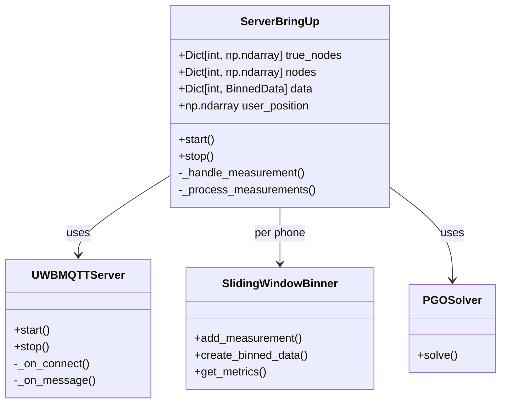
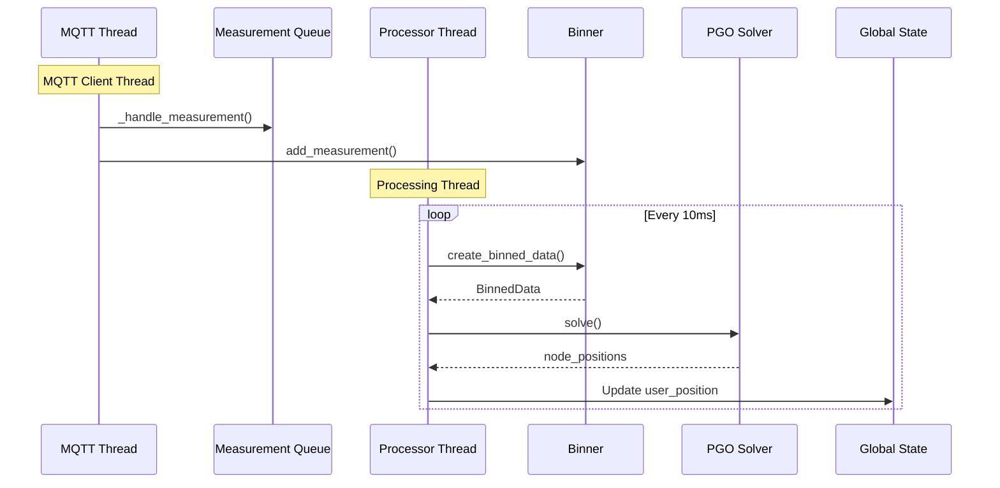
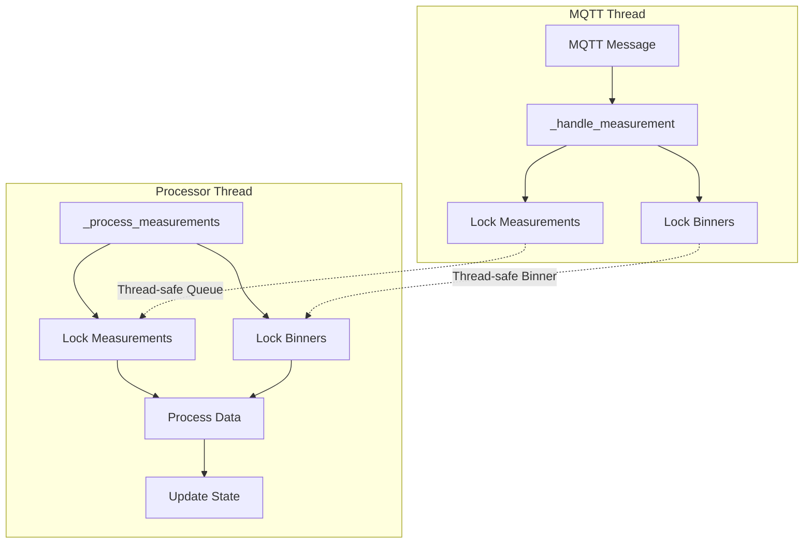
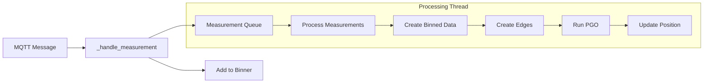
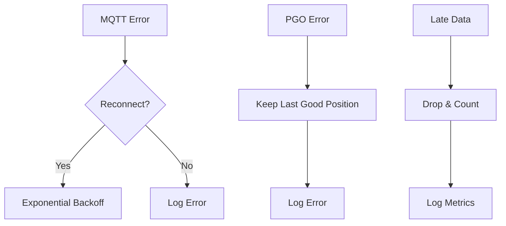

# Server Bring-up Architecture

## Overview

The Server Bring-up coordinates multiple components to process UWB measurements into global positions:
- MQTT message handling
- Thread-safe measurement binning
- Edge creation
- PGO solving
- State management

## Core Architecture



## Threading Model & Data Flow



## Thread Safety & Synchronization



## Component Details

### 1. State Management
```python
class ServerBringUp:
    def __init__(self):
        # Ground truth
        self.true_nodes = {
            0: np.array([440, 550, 0]),  # top-right
            1: np.array([0, 550, 0]),    # top-left
            2: np.array([440, 0, 0]),    # bottom-right
            3: np.array([0, 0, 0])       # bottom-left
        }
        
        # Working state
        self.data = {}  # phone_node_id -> BinnedData
        self.user_position = None
```

### 2. Thread-Safe Data Structures
```python
# Thread-safe measurement queue
self._measurements_lock = threading.Lock()
self._measurements: Dict[int, Queue[Measurement]] = defaultdict(Queue)

# Thread-safe binners
self._binners_lock = threading.Lock()
self._binners: Dict[int, SlidingWindowBinner] = {}
```

### 3. Callback Chain



## Threading Details

### MQTT Thread
- Runs MQTT event loop (`paho.mqtt.client`)
- Handles incoming messages via callbacks
- Thread-safe operations:
  1. Queue measurements
  2. Add to binner
- Never blocks for long operations

### Processor Thread
- Runs every 10ms
- Processes queued measurements
- Creates binned data
- Runs PGO
- Updates global state
- Uses locks for thread safety

## Synchronization Patterns

### 1. Double Buffer Pattern
```python
def _handle_measurement(self, measurement: Measurement):
    """Thread-safe double buffering."""
    # Add to queue for processing
    with self._measurements_lock:
        self._measurements[measurement.phone_node_id].put(measurement)
    
    # Also add to binner for windowing
    with self._binners_lock:
        binner = self._get_or_create_binner(measurement.phone_node_id)
        binner.add_measurement(measurement)
```

### 2. State Updates
```python
def _process_measurements(self):
    """Thread-safe state updates."""
    while not self._stop_event.is_set():
        with self._measurements_lock:
            # Process measurements
            
        if pgo_result.success:
            # Atomic update of user position
            self.user_position = pgo_result.node_positions[f'phone_{phone_id}']
```

## Error Handling



## Metrics & Monitoring

The server tracks several metrics:
1. Binning metrics:
   - Late drops
   - Measurements per anchor
   - Window spans
2. PGO metrics:
   - Solve time
   - Error values
   - Iteration counts
3. MQTT metrics:
   - Connection status
   - Message counts
   - Queue sizes

## Setup & Usage

### 1. Start MQTT Broker
First, start the MQTT broker on your laptop:

```bash
# Create mosquitto.conf if not exists
echo "listener 1884
allow_anonymous true" > mosquitto.conf

# Start Mosquitto with this config
mosquitto -c mosquitto.conf
```

### 2. Start Server
Start the server with your laptop's IP:

```python
# Configure MQTT with your laptop's IP
mqtt_config = MQTTConfig(
    broker="192.168.68.66",  # Replace with your laptop's IP, or tbh it doesnt matter cuz we add the laptop ip as an argument when calling the file
    port=1884
)

# Start server
server = ServerBringUp(
    mqtt_config=mqtt_config,
    window_size_seconds=1.0
)

try:
    server.start()
    print("Server started. Waiting for anchor connections...")
    while True:
        if server.user_position is not None:
            print(f"Current position: {server.user_position}")
        time.sleep(1)
except KeyboardInterrupt:
    server.stop()
```

### 3. Verify Operation
Monitor the server logs for:
- MQTT connection status
- Anchor connections
- Measurement processing
- Position updates

Common log messages:
```json
{"event": "server_initialized", "n_anchors": 4}
{"event": "mqtt_connected", "topic": "uwb/anchor/+/vector"}
{"event": "position_updated", "position": [x, y, z]}
```

### 4. Troubleshooting
- If anchors can't connect, verify:
  1. Mosquitto is running (`ps aux | grep mosquitto`)
  2. Port 1884 is open (`netstat -an | grep 1884`)
  3. Laptop's IP is correct and accessible
  4. No firewall blocking connections
