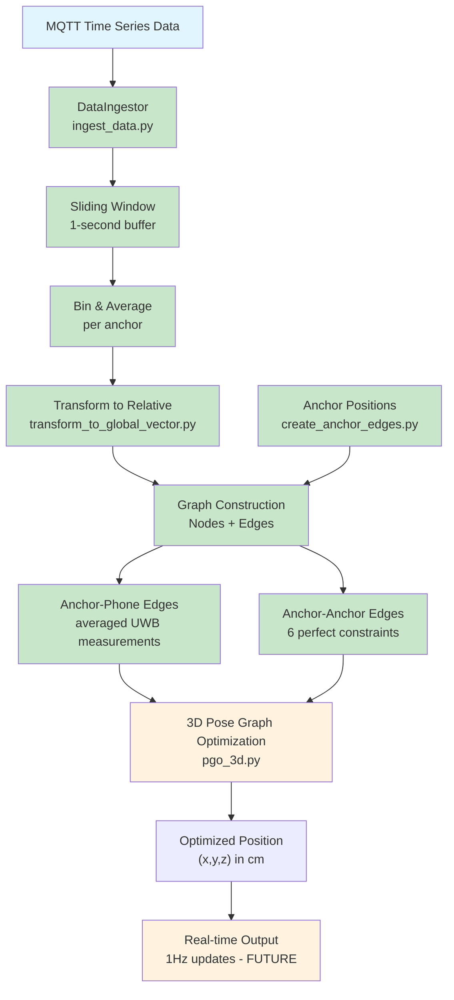

## Overall objective

1. Take in time series data from MQTT from Boards (this should not be anchored)
2. Apply transform_to_global_vector.py
    - This should result in something that is still a floating vector (but annoted with nodes, eg (anchor 0, phone) with a corresponding vector)

3. Construct the complete graphwith all edges, (using the hard coded version of position of anchors)
    - Simulate anchor - anchor edges inside the graph pose optimization (lets do a perfect version for now)
4. Data handling, bin all the data from the last 1 second, take the average from each
5. perform full PGO as per pgo_test.py to give compelte position (should update at 1hz)
    - The final output should be a simple (x,y,z) in cm of where the phone is in after PGO in the global coordinate

## System Architecture Flow



**Legend:**
- 🟢 **Completed**: Steps 2-5 implemented + Real data testing
- 🟡 **Future**: Steps 1, 6 to implement

## ✅ Complete System Test with Real Data

**Successfully tested the entire PGO pipeline** using real UWB data from `uwb_data_A_20250916_175743.csv`:

- **Input**: Multiple datasets (20 rows each) → 20 UWB measurements from 4 anchors
- **Processing**: DataIngestor → 3D PGO → Anchoring transformation
- **Anchoring**: Fixed anchor_3 at (0,0,0) + anchor_2 at (440,0,0) to prevent rotation
- **Output**: Stable phone positions across different time periods + visualization plot
- **Results**: Much more consistent positioning, no wild rotations, positions within expected ranges

## Implementation Status & Details

### ✅ Step 2: Transform to Relative Measurements

**What we built**: `transform_to_global_vector.py` with `create_relative_measurement()`
- **Input**: Raw UWB vector in anchor's local coordinate system + anchor ID + phone node ID
- **Processing**: Rotate vector from anchor's local frame to global coordinate system
- **Output**: Relative displacement tuple `(anchor_node, phone_node, displacement_vector)`
- **Key change**: Returns relative constraint, not absolute position
- **Files**: `transform_to_global_vector.py` (rotation logic), `create_anchor_edges.py` (anchor definitions)

### ✅ Step 3: Graph Construction with Anchor-Anchor Edges

**What we built**: `create_anchor_anchor_edges()` function
- **Purpose**: Creates perfect geometric constraints between anchor positions
- **Implementation**: All 6 pairs (0-1, 0-2, 0-3, 1-2, 1-3, 2-3) with exact distances
- **Format**: Same tuple format as relative measurements for consistency
- **Benefit**: Provides geometric "loop closures" for better optimization stability
- **Files**: `create_anchor_edges.py`

### ✅ Step 4: Data Handling & 1-Second Binning

**What we built**: `DataIngestor` class in `ingest_data.py`
- **Sliding Window**: Maintains 1-second buffer of raw measurements
- **Automatic Cleanup**: Removes measurements older than 1 second
- **Binning Logic**: Groups measurements by anchor within current window
- **Averaging**: Handles multiple measurements per anchor (variable sample rates)
- **Graph Construction**: Creates **floating nodes** (all None initially) + relative edges
- **Anchoring**: Post-PGO transformation using `apply_anchoring_transformation()`
- **Output Format**: `{'nodes': {...}, 'edges': [...], 'binned_data': ...}` ready for PGO
- **Real-time Ready**: `get_latest_graph_data()` provides fresh data every second

**Technical Details:**
- Uses `collections.deque` for efficient sliding window
- Handles missing data gracefully (uses only available anchors)
- Generates unique node IDs (`phone_bin_1`, `phone_bin_2`, etc.)
- **Anchors are floating** during optimization, pinned to known positions afterward
- Integrates all components: transforms + anchor edges + binning

### ✅ Step 5: 3D Pose Graph Optimization

**What we built**: `solve_pose_graph_3d()` function in `pgo_3d.py`
- **Input**: Graph data dict from `DataIngestor` with floating nodes and relative edges
- **Optimization**: 3D least squares minimization using `scipy.optimize.least_squares`
- **Anchoring**: Fixes gauge freedom by anchoring one node (anchor_3 at origin)
- **Output**: Optimized 3D positions for all nodes in relative coordinate frame
- **Integration**: Works seamlessly with `apply_anchoring_transformation()` for final global coordinates

**Key Features:**
- **3D displacements**: Handles (x,y,z) measurements instead of 2D
- **String node names**: Supports 'anchor_0', 'phone_bin_1', etc. instead of integers
- **Flexible anchoring**: Can anchor any subset of nodes to fixed positions
- **Robust optimization**: Uses trust region reflective algorithm with fallback handling
- **Real-time ready**: Designed for 1Hz updates with fast convergence

## Detailed Implementation Plan

### Current Issue: Absolute vs Relative Measurements
**Problem**: Current `transform_to_global_vector.py` incorrectly converts to absolute positions. Step 2 should produce "floating vectors" (relative measurements between nodes).

### Step-by-Step Implementation:

## 1. Data Ingestion (Time Series from MQTT)
- **Input**: Raw UWB measurements from boards (not anchored)
- **Format**: `{timestamp, anchor_id, local_vector_x, local_vector_y, local_vector_z}`
- **Goal**: Collect measurements without assuming anchor positions

## 2. Transform to Relative Measurements ❌ (Current: Absolute)
**Current Problem**: `transform_to_global_vector.py` returns absolute positions

**Correct Implementation Needed**:
- Transform local vectors to **relative displacements** between nodes
- **Nodes**: Each measurement becomes an edge between `{anchor_id}` → `{phone_pose_at_timestamp}`
- **Output**: List of relative vectors: `[(anchor_node, phone_node, displacement_vector), ...]`

## 3. Graph Construction
**Nodes**:
- Anchor nodes (0,1,2,3) with **fixed known positions** (3D)
- Phone pose nodes (one per 1-second bin) with **unknown positions to optimize** (3D)

**Edges**:
- **Anchor→Phone edges**: From averaged UWB measurements (3D relative displacements)
- **Phone→Phone edges**: Temporal constraints between consecutive bins (future enhancement)
- **Anchor→Anchor edges**: Fixed constraints between known anchor positions ("perfect version", 3D)

**Anchor-Anchor Edges (6 total):**
- Add ALL pairs: (0-1, 0-2, 0-3, 1-2, 1-3, 2-3)
- Use exact known distances between anchor positions (perfect version = zero noise)
- **Pinning**: Anchor 3 at (0,0,0), Anchor 0 at top-right
- Create function that outputs these edges in same format as relative measurements

## 4. Data Handling (1-second Binning)
**Temporal Processing:**
- **Sliding window**: Overlapping 1-second bins (moving average style)
- Average measurements from each anchor within each window
- Create one phone pose node per 1-second bin
- **Missing data**: Use only available anchor measurements for PGO

## 5. Real-time PGO (1Hz Updates)
**Real-time Processing:**
- **Incremental PGO**: Update existing solution rather than full re-optimization
- Run optimization every 1 second on current measurement window
- **Output**: (x,y,z) position in cm (global coordinates, same as ANCHORS)
- Maintain graph with recent history + fixed anchors

### Key Changes Needed:

#### A. Fix `transform_to_global_vector.py`
Instead of:
```python
def transform_to_global_vector(anchor_id, local_vector) -> absolute_position:
    return ANCHORS[anchor_id] + ROTATED_VECTOR
```

It should be:
```python
def create_relative_measurement(anchor_id, phone_node_id, local_vector) -> relative_edge:
    return (anchor_id, phone_node_id, ROTATED_VECTOR)  # displacement from anchor to phone
```

#### B. Graph Construction
```python
# Nodes: anchors (known) + phone poses (unknown)
nodes = {
    'anchor_0': ANCHORS[0],  # fixed
    'anchor_1': ANCHORS[1],  # fixed
    'anchor_2': ANCHORS[2],  # fixed
    'anchor_3': ANCHORS[3],  # fixed
    'phone_t1': unknown,     # to optimize
    'phone_t2': unknown,     # to optimize
    ...
}

# Edges: relative measurements
edges = [
    ('anchor_0', 'phone_t1', measured_vector_0_to_phone_at_t1),
    ('anchor_1', 'phone_t1', measured_vector_1_to_phone_at_t1),
    ('anchor_2', 'phone_t1', measured_vector_2_to_phone_at_t1),
    ...
]
```

#### C. PGO Optimization
- **Fixed nodes**: Anchors stay at known positions
- **Optimized nodes**: Phone poses solved simultaneously
- **Constraints**: All relative displacement measurements must be satisfied

## 6. Full PGO Optimization
Using `pgo_test.py` approach but extended to 3D:
- **Variables**: 3D positions of all phone poses (anchors fixed)
- **Constraints**: All 3D relative displacement measurements
- **Objective**: Minimize `Σ||estimated_displacement - measured_displacement||²`
- **Incremental updates**: Update existing solution rather than full re-optimization

### Expected Benefits vs Current `uwb_pgo.py`:

| Current `uwb_pgo.py` | New Full PGO |
|---------------------|--------------|
| Independent optimization per timestamp | **Global optimization** across all timestamps |
| No temporal consistency | **Can add temporal constraints** (future) |
| Position averaging | **True pose graph with loop closures possible** |
| 4 anchors × K timestamps = 4K constraints | **Full graph with cross-links** |

### Implementation Priority:

✅ 1. **Fix `transform_to_global_vector.py`** → Return relative measurements, not absolute positions
✅ 2. **Implement 1-second data binning** → Collect, average, and timestamp measurements
✅ 3. **Create graph construction module** → Build nodes and edges (including anchor-anchor edges)
✅ 4. **Extend `pgo_test.py`** → Support 3D, fixed anchor nodes, real-time 1Hz updates
🟡 5. **Add temporal edges** → Optional: connect consecutive phone poses for smoothness
🟡 6. **Implement real-time output** → (x,y,z) position publishing at 1Hz