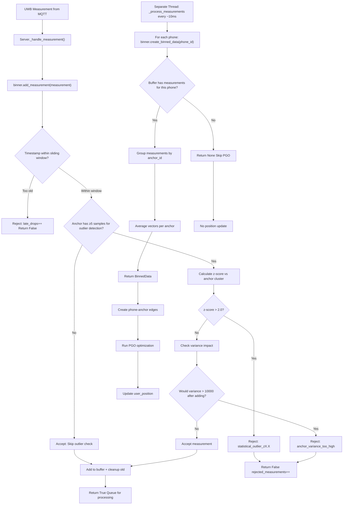
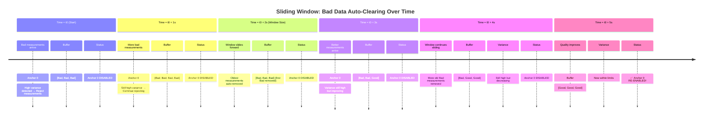
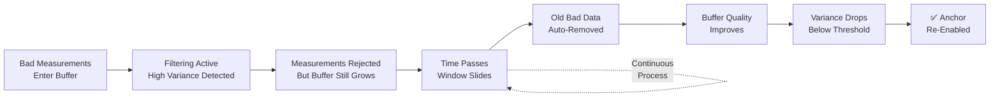

# UWB Filtering System: Complete Guide

## Overview
The UWB filtering system implements a sophisticated data quality control mechanism using statistical outlier detection and variance-based filtering within a sliding time window. This system automatically rejects bad measurements while allowing anchors to "self-heal" over time through temporal decay.

---

## System Architecture

### Two-Stage Filtering Pipeline

#### Stage 1: Per-Measurement Filtering (`add_measurement()`)
Real-time filtering as measurements arrive from MQTT.

#### Stage 2: Temporal Self-Healing (Sliding Window)
Automatic recovery through time-based data management.

---

## Detailed Flow Diagrams

### Measurement Ingestion & Filtering Flow



### Temporal Self-Healing Mechanism



---

## Core Concepts

### Sliding Window Behavior
1. **Time-based buffer**: Maintains measurements within `window_size_seconds` (default 2.0s)
2. **Automatic cleanup**: Old measurements beyond the time window are automatically removed
3. **Continuous update**: As new measurements arrive, old ones expire and are removed

### Statistical Outlier Detection
- **Z-score calculation**: `(distance - mean) / std_deviation`
- **Cluster-based**: Compares new measurements to existing anchor measurements
- **Threshold**: `z-score > outlier_threshold_sigma` (default 2.0 = 2.3% tail rejection)
- **Warm-up period**: First `min_samples_for_outlier_detection` (default 5) measurements always accepted

### Per-Anchor Variance Control
- **Predictive filtering**: Checks variance impact before adding measurement
- **Formula**: Calculates `var(existing + new_measurement)`
- **Threshold**: `max_anchor_variance` (default 10000 cm² = 100cm std deviation)
- **Per-anchor**: Each anchor maintains separate variance statistics

### Temporal Self-Healing


---

## Configuration Parameters

### Default Configuration
```python
binner = SlidingWindowBinner(
    window_size_seconds=2.0,        # 2-second sliding window
    outlier_threshold_sigma=2.0,    # Reject 2.3% statistical outliers
    min_samples_for_outlier_detection=5,  # Warm-up period
    max_anchor_variance=10000.0     # Max 100cm std deviation per anchor
)
```

### Tuning Guidelines

#### Aggressive Filtering (Faster rejection, higher accuracy)
```python
binner = SlidingWindowBinner(
    window_size_seconds=1.0,        # Shorter window
    outlier_threshold_sigma=1.5,    # Stricter outliers (1.4% rejection)
    min_samples_for_outlier_detection=3,  # Shorter warm-up
    max_anchor_variance=5000.0      # Stricter variance (71cm std)
)
```

#### Conservative Filtering (Slower rejection, more data)
```python
binner = SlidingWindowBinner(
    window_size_seconds=3.0,        # Longer window
    outlier_threshold_sigma=2.5,    # Looser outliers (1.2% rejection)
    min_samples_for_outlier_detection=8,  # Longer warm-up
    max_anchor_variance=15000.0     # Looser variance (122cm std)
)
```

### Parameter Impact Matrix

| Parameter | Lower Value → | Higher Value → |
|-----------|---------------|----------------|
| `window_size_seconds` | Faster recovery, less stable | Slower recovery, more stable |
| `outlier_threshold_sigma` | More rejection, higher accuracy | Less rejection, lower accuracy |
| `max_anchor_variance` | Stricter filtering, higher quality | Looser filtering, more noise |
| `min_samples_for_outlier_detection` | Shorter warm-up, faster filtering | Longer warm-up, delayed filtering |

---

## Real-World Scenarios

### Scenario 1: Temporary WiFi Interference
```
t0-t2: WiFi interference → multipath → high variance → reject Anchor 0
t3-t4: Interference clears → good measurements arrive → buffer improves
t5+: Old bad measurements cleared → variance normal → Anchor 0 re-enabled
```

### Scenario 2: Persistent Hardware Issue
```
t0+: Hardware problem → consistently bad → stays rejected
      System continues with other anchors → graceful degradation
```

### Scenario 3: Gradual Quality Improvement
```
t0: Poor calibration → high variance → rejected
t1-t3: Calibration improves gradually → variance decreases slowly
t4: Quality threshold reached → anchor re-enabled
```

---

## Monitoring & Debugging

### Log Output Examples

#### Normal Operation
```json
{
  "event": "binning_metrics",
  "phone_id": 0,
  "metrics": {
    "accepted": 95,
    "rejected": 5,
    "late_drops": 0,
    "rejection_rate": "5.0%",
    "rejection_reasons": {
      "statistical_outlier_z2.1_anchor1": 3,
      "anchor_variance_too_high_11000_anchor2": 2
    },
    "per_anchor": {
      "0": 25, "1": 24, "2": 23, "3": 23
    }
  }
}
```

#### Anchor Recovery in Progress
```json
// Initially problematic
{
  "rejection_reasons": {"anchor_variance_too_high_12000_anchor0": 15}
}

// During recovery
{
  "rejection_reasons": {"anchor_variance_too_high_8000_anchor0": 5}
}

// Fully recovered
{
  "rejection_reasons": {"statistical_outlier_z2.1_anchor1": 3}
}
```

### Position Update Logs
```json
{
  "event": "position_updated",
  "phone_id": 0,
  "position": [240.1, 300.2, 150.0],
  "error": 45.2,
  "metrics": {
    "n_edges": 13,
    "n_phone_edges": 3,    // Only 3 anchors active
    "n_anchor_edges": 10
  }
}
```

---

## Implementation Details

### Filter Logic Flow

1. **Timestamp Check**: Reject measurements older than sliding window
2. **Sample Count Check**: If < `min_samples_for_outlier_detection`, accept
3. **Statistical Outlier Check**: Calculate z-score vs anchor cluster
4. **Variance Impact Check**: Predict variance after adding measurement
5. **Buffer Addition**: If all checks pass, add to sliding window

### Edge Cases Handled

- **Empty anchor history**: Skip outlier check, rely on variance check
- **Single measurement**: Variance calculation requires ≥2 measurements
- **All measurements rejected**: PGO runs with available anchors (graceful degradation)
- **Sliding window cleanup**: Automatic removal of expired measurements

### Performance Characteristics

- **Memory**: O(n) where n = measurements in sliding window
- **CPU**: O(1) per measurement (constant time operations)
- **Filtering delay**: Sub-millisecond per measurement
- **Self-healing time**: Configurable via `window_size_seconds`

---

## Troubleshooting Guide

### Issue: Too many rejections
**Symptoms**: High rejection rate (>20%), poor positioning
**Causes**: Thresholds too strict
**Solutions**:
- Increase `outlier_threshold_sigma` (e.g., 2.0 → 2.5)
- Increase `max_anchor_variance` (e.g., 10000 → 15000)
- Decrease `min_samples_for_outlier_detection` (e.g., 5 → 3)

### Issue: Too few rejections
**Symptoms**: Poor position accuracy, jumpy estimates
**Causes**: Thresholds too loose
**Solutions**:
- Decrease `outlier_threshold_sigma` (e.g., 2.5 → 2.0)
- Decrease `max_anchor_variance` (e.g., 15000 → 10000)
- Increase `min_samples_for_outlier_detection` (e.g., 3 → 5)

### Issue: Anchors never re-enable
**Symptoms**: Consistent rejection of specific anchors
**Causes**: Persistent hardware issues or environmental problems
**Solutions**:
- Increase `window_size_seconds` (e.g., 2.0 → 3.0)
- Check physical anchor setup
- Monitor environmental interference (WiFi, metal objects)

### Issue: System stalls with no position updates
**Symptoms**: No position updates, PGO not running
**Causes**: All anchors filtered out
**Solutions**:
- Loosen filtering thresholds temporarily
- Check anchor hardware connections
- Reduce `window_size_seconds` for faster recovery

---

## Summary

The UWB filtering system provides:

✅ **Real-time quality control**: Statistical outlier and variance filtering
✅ **Automatic recovery**: Sliding window temporal self-healing
✅ **Graceful degradation**: System continues with available anchors
✅ **Configurable sensitivity**: Adjustable thresholds for different environments
✅ **Comprehensive monitoring**: Detailed metrics and rejection tracking

**Key insight**: Bad data doesn't break the system - it gets filtered out and automatically clears over time, allowing anchors to "heal" themselves without manual intervention.

---

*Documentation generated from filtering_flow.md and sliding_window_temporal.md*
