# UWB Localization Platform - Application Architecture

## Marketing Overview: Build Amazing Apps in Minutes, Not Months

```mermaid
graph TB
    subgraph "🏗️ UWB Localization Platform"
        CORE[📦 Core Packages<br/>Ready-to-use components]
        SERVER[🖥️ Server<br/>Real or simulated data]
    end
    
    subgraph "🎨 Your Custom App"
        PYQT[🖼️ PyQT Visualization Demo<br/>• Load any floorplan image<br/>• Click 4 corners = instant mapping<br/>• Drag & drop interactive zones<br/>• Real-time position tracking]
    end
    
    CORE --> PYQT
    SERVER --> PYQT
    
    CORE -.->|"Just import & use"| TEXT1["✨ No complex setup<br/>✨ No reinventing algorithms<br/>✨ Focus on YOUR features"]
    
    classDef platform fill:#e3f2fd,stroke:#1976d2,stroke-width:3px
    classDef app fill:#f3e5f5,stroke:#7b1fa2,stroke-width:3px
    classDef benefit fill:#e8f5e8,stroke:#388e3c,stroke-width:2px
    
    class CORE,SERVER platform
    class PYQT app
    class TEXT1 benefit
```

## The Message
**"Our baseline packages do the heavy lifting. You build the magic."**

- **Left side**: Robust, tested foundation
- **Right side**: Your creative application  
- **Arrow**: Seamless integration
- **Bottom**: The developer benefits
