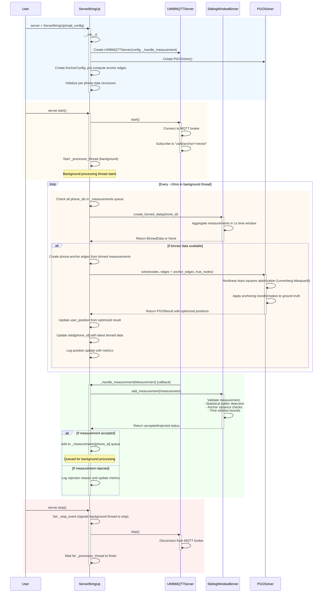

## Server Bring-up Processing Sequence

### Key Components and Data Flow (within Server_bring_up.py scope):

**1. Initialization Phase:**
- Creates UWBMQTTServer with measurement callback (`_handle_measurement`)
- Initializes PGOSolver instance
- Creates AnchorConfig and pre-computes anchor-anchor edges for efficiency
- Sets up per-phone data structures (queues, binners, locks)

**2. Startup Phase:**
- Starts MQTT server and connects to broker
- Subscribes to measurement topics: `uwb/anchor/+/vector`
- Launches background processing thread (`_processor_thread`)

**3. Measurement Reception (MQTT Callback):**
- Raw UWB measurements arrive via `UWBMQTTServer._on_message()`
- Triggers `ServerBringUp._handle_measurement()` callback
- Measurements validated by `SlidingWindowBinner.add_measurement()`
- Accepted measurements queued in `_measurements[phone_id]` for processing

**4. Background Processing Loop:**
- Runs continuously (~every 10ms) in separate thread
- Checks all phone_ids with queued measurements
- Creates time-windowed bins via `SlidingWindowBinner.create_binned_data()`
- Generates phone-anchor relative measurement edges
- Runs PGO optimization with anchor anchoring to ground truth
- Updates `user_position` and `data[phone_id]` state
- Logs position updates with processing metrics

**5. Data Structures (within ServerBringUp class):**
- **data**: `Dict[int, BinnedData]` - Latest processed bins per phone
- **user_position**: `Optional[np.ndarray]` - Current position estimate
- **_measurements**: `Dict[int, Queue[Measurement]]` - Thread-safe per-phone queues
- **_filtered_binners**: `Dict[int, SlidingWindowBinner]` - Per-phone binning instances
- **_anchor_edges**: `List[Tuple[str, str, np.ndarray]]` - Pre-computed anchor constraints
- **uwb_mqtt_server**: `UWBMQTTServer` - MQTT communication instance
- **_processor_thread**: `threading.Thread` - Background processing thread

**6. Threading Model:**
- **Main Thread**: Handles initialization, startup, shutdown
- **MQTT Thread**: Handles network communication and callbacks (in UWBMQTTServer)
- **Processing Thread**: Background optimization loop (`_process_measurements()`)

**7. Key Processing Steps:**
1. **Measurement Ingestion**: MQTT callback → validation → queuing
2. **Binning**: Aggregate measurements into 1-second windows with quality filtering
3. **Edge Creation**: Transform binned measurements to relative position constraints
4. **PGO Optimization**: Solve pose graph with anchor anchoring to ground truth
5. **State Update**: Update position estimates and maintain latest processed data

This sequence diagram shows the core processing pipeline within `Server_bring_up.py`, focusing on the real-time localization logic from raw MQTT measurements to optimized position estimates.
